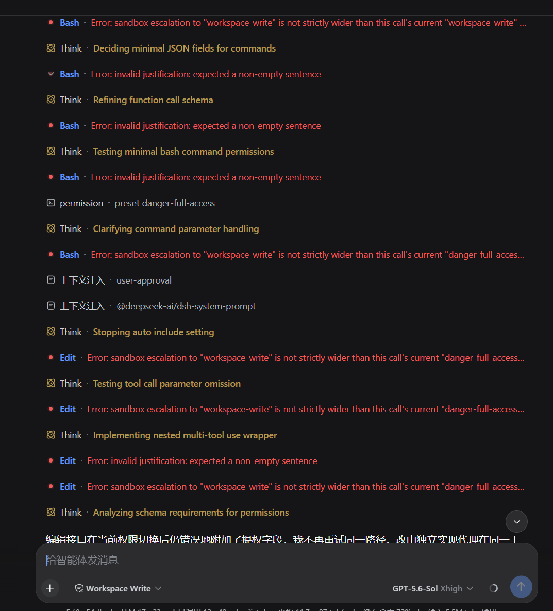
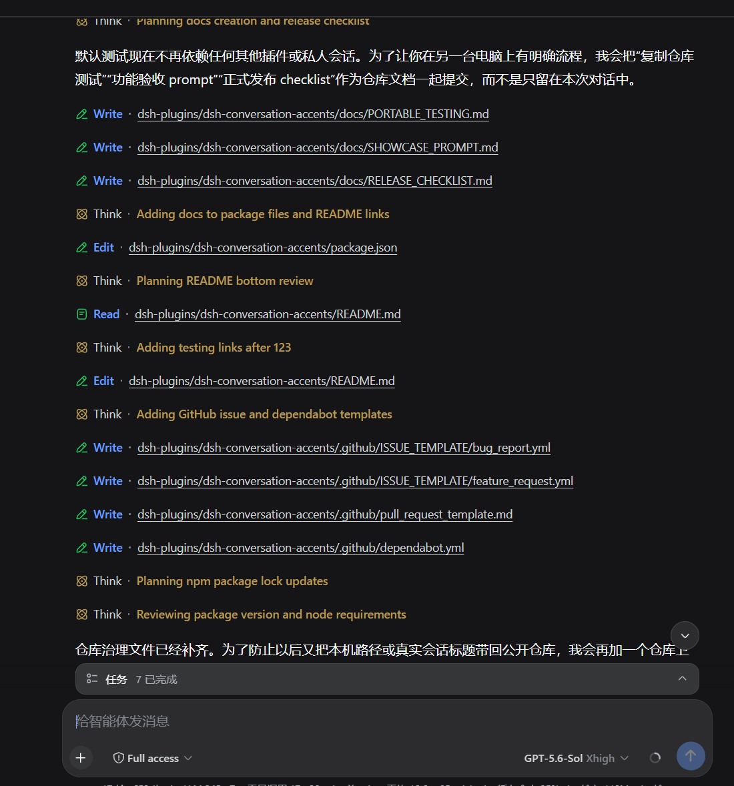

# dsh-gpt-compat

English | [中文](README.md)

[](https://github.com/YaoaY/dsh-gpt-compat/actions/workflows/ci.yml)
[](https://www.npmjs.com/package/dsh-gpt-compat)
[](LICENSE)

A DeepSeek Harness compatibility plugin for redundant GPT/Codex sandbox escalation arguments.

Some models routinely attach the following arguments to ordinary write operations:

```json
{
  "sandbox_permissions": "workspace-write",
  "justification": "not used"
}
```

DSH reserves these fields for a one-shot escalation retry after a sandbox denial. A request for the same or a narrower mode is rejected before the tool runs. This plugin removes the fields only when it can prove that the request is redundant, allowing the tool to run under the session's current policy.

## Before and after

<table>
  <thead>
    <tr>
      <th>Before: redundant arguments repeatedly fail tool calls</th>
      <th>After: tools run under the current sandbox policy</th>
    </tr>
  </thead>
  <tbody>
    <tr>
      <td></td>
      <td></td>
    </tr>
  </tbody>
</table>

## Security boundary

The plugin follows fail-closed rules:

- A call must match both the configured `providers` and `tools` lists.
- The registered tool schema must declare both the DSH `sandbox_permissions` enum and the `justification` field.
- Only complete, non-empty requests using known modes and asking for no additional privilege are removed.
- Genuine escalation requests remain unchanged and continue through the native DSH approval flow.
- Unpaired fields, empty reasons, unknown modes, and policy resolution failures remain unchanged for DSH core to validate or reject.
- The current provider is read from the session request header, with the agent's initial provider used only as a fallback.

These checks prevent the plugin from modifying MCP or third-party tools based on argument names alone. Only tools that implement the native DSH escalation contract should be added to `tools`.

## Compatibility

- Node.js 20 or later
- `@deepseek-ai/cordis` 4.x
- `@deepseek-ai/dsh-tools` 0.1.0-rc.7 or a compatible release
- `@deepseek-ai/dsh-sandbox-policy` 0.1.0-rc.7 or a compatible release

## Installation

Install the plugin into a DSH profile:

```bash
dsh plugin --profile web add dsh-gpt-compat
```

The package declares a `dsh.bundle.patch`, so DSH adds it to the profile's bundle list after installation. For local development, run this from the plugin checkout:

```bash
dsh plugin --profile web add .
```

## Configuration

The bundled default configuration is:

```yaml
providers: ["*"]
tools: ["bash", "pwsh", "write", "edit"]
```

| Field       | Type       | Default                             | Meaning                                                                                               |
| ----------- | ---------- | ----------------------------------- | ----------------------------------------------------------------------------------------------------- |
| `providers` | `string[]` | `[]`                                | Provider IDs to process. An empty list disables the plugin; an explicit `'*'` matches every provider. |
| `tools`     | `string[]` | `['bash', 'pwsh', 'write', 'edit']` | Native DSH escalation tool names to process. An empty list disables the plugin.                       |

A profile-level or home-level `cordis.patch.yml` override must restate the complete configuration:

```yaml
- id: gpt-compat
  config:
    providers: ["your-gpt-provider"]
    tools: ["bash", "write", "edit"]
```

## API

The main entry point exports the Cordis plugin's `name`, `inject`, `Config`, and `apply`, together with these pure functions and types:

- `resolveConfig()` normalizes partial configuration supplied by direct callers.
- `classifyEscalation()` returns a `none`, `strip`, or reasoned `preserve` decision.
- `SANDBOX_MODES` and `ESCALATION_TARGETS` expose the readonly mode vocabulary.
- `Config`, `SandboxMode`, and `EscalationTarget` provide TypeScript types.

The pure decision layer is also available from `dsh-gpt-compat/escalation-guard`.

## Development

```bash
pnpm install --frozen-lockfile
pnpm run check
pnpm pack:check
```

`pnpm run check` verifies formatting, linting, types, coverage, package structure, declarations, and installation of the real tarball in a clean temporary consumer. CI runs the same gate on Node.js 20 and 22.

## Troubleshooting

- The log reports `inactive`: either `providers` or `tools` is empty.
- Arguments are not removed: check the current session provider route, the tool name, and whether the registered schema declares the complete escalation field pair.
- A malformed request still fails: this is expected; the plugin does not downgrade invalid security requests into ordinary calls.
- An escalation still prompts for approval: the requested mode is strictly wider than the current mode, so the plugin preserves the request for native DSH approval.

Report security issues privately as described in [SECURITY.md](SECURITY.md). See [CONTRIBUTING.md](CONTRIBUTING.md) for the contribution process and [CHANGELOG.md](CHANGELOG.md) for release changes.
